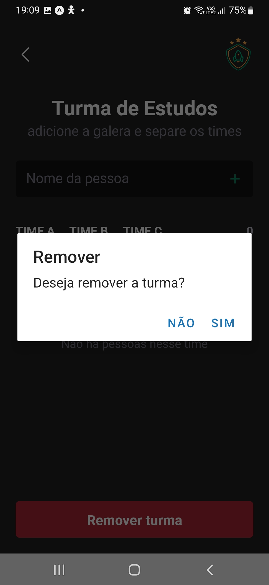

# igniteteams
igniteteams

  Foi desenvolvida uma aplicação no Visual Studio Code do curso de Formação React Native da [ROCKETSEAT](https://www.rocketseat.com.br/). O objetivo dessa aplicação é facilitar a organização de grupos de jogos. A aplicação utiliza navegação em pilha e armazenamento local ou seja, todos os dados são salvos diretamente no seu celular. Ela permite que você gerencie várias turmas, adicionando ou removendo jogadores com facilidade. . 
  
  Durante as aulas foram aprendidos conteúdos relacionados a: estilização utilizando o Styled Components, navegação com Stack Navigator, persistência de dados com AsyncStorage TouchableOpacity, StatusBar, FlatList, criação de componentes, Hooks e Estado. 
<br>
<br>
<p align="center">
  <a href="#funcionalidades">Funcionalidades</a>&nbsp;&nbsp;&nbsp;|&nbsp;&nbsp;&nbsp;
  <a href="#heavy_check_mark-requisitos-necessários">Requisitos necessários</a>&nbsp;&nbsp;&nbsp;|&nbsp;&nbsp;&nbsp;
  <a href="#arrow_down_small-clonando-o-repositório">Clonando o repositório</a>&nbsp;&nbsp;&nbsp;|&nbsp;&nbsp;&nbsp;
  <a href="#beginner-iniciando-a-aplicação">Iniciando a aplicação</a>&nbsp;&nbsp;&nbsp;|&nbsp;&nbsp;&nbsp;
  <a href="#wrench-tecnologias--ferramentas--recursos">Tecnologias | Ferramentas | Recursos</a>&nbsp;&nbsp;&nbsp;|&nbsp;&nbsp;&nbsp;
  <a href="#memo-license">Licença</a>
</p>


### Funcionalidades

- Cadastrar Grupos;
- Cadastrar Pessoas; 
- Listar Grupos cadastrados em lista;
- Listar Pessoas cadastradas em lista;
- Excluir Grupos;
- Excluir Pessoas;

  


 <p align="center">
    
    
    
    
    
  </p>

### :heavy_check_mark: Requisitos necessários

Seguem as configurações neessárias para visualizar a aplicação em sua máquina.
 
- Android Studio
- Git
- Celular(Opcional)
- Node.js
- React
- React-Native
- Expo
- TypeScript
- Yarn(ou NPM)

### :arrow_down_small: Clonando o repositório
1. Pelo terminal, acesse o diretório em que deseja ter o repositório clonado e execute o comando a seguir.
```bash
# clonando o repositório
git clone https://github.com/Diegototi/igniteteams.git
```

### :beginner: Iniciando a aplicação
Abra o projeto e instale as dependências e rode o projeto:

cd imhere <br>
npm install <br>
npx expo start <br>

### :wrench: Tecnologias | Ferramentas | Recursos

Esse projeto foi desenvolvido utilizando os seguintes recursos:

- [Vs Code](https://code.visualstudio.com/download);
- Visual Studio Code
- Android Studio
- Javascript
- NodeJS
- Expo
- React
- React Native
- TypeScript
- NPM

### :memo: License
Esse projeto está sob MIT license. Veja [LICENSE](https://github.com/Diegototi/series-console-app/blob/main/LICENSE) para mais informações.

---

Feito por Diego Almeida :blue_heart: Contato: https://www.linkedin.com/in/diego-almeida-a8394a215 :blush:
